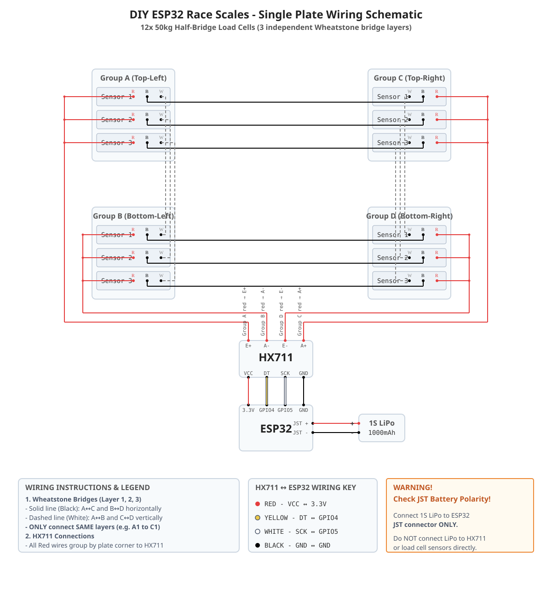

# One-Plate Wiring Guide



This guide covers one scale plate containing twelve three-wire, 50 kg half-bridge load cells. The cells are arranged as three matched sensor layers across four physical support groups. Each layer forms one Wheatstone bridge; the three completed bridges share the same four HX711 nodes.

> **Do not join every black wire together or every white wire together.** Black and white joins are made only between the specified matching sensor numbers.

## Label the plate

Viewed from above:

```text
Front / top

 A1 A2 A3                     C1 C2 C3


 B1 B2 B3                     D1 D2 D3

Rear / bottom
```

Use the same sensor number at all four support groups to form one bridge:

- Layer 1: `A1`, `B1`, `C1`, `D1`
- Layer 2: `A2`, `B2`, `C2`, `D2`
- Layer 3: `A3`, `B3`, `C3`, `D3`

## Wire each bridge layer

Repeat this table independently for `n = 1`, `2`, and `3`.

| Wire color | Connection 1 | Connection 2 | Direction on plate |
|---|---|---|---|
| Black | `Aₙ ↔ Cₙ` | `Bₙ ↔ Dₙ` | Left to right |
| White | `Aₙ ↔ Bₙ` | `Cₙ ↔ Dₙ` | Front to rear |

For example, layer 1 has four joins: black `A1-C1`, black `B1-D1`, white `A1-B1`, and white `C1-D1`. Do not connect any layer-1 black or white join to layer 2 or 3.

## Join the red bridge nodes

After all three layers are complete, join red wires by physical support group:

| Red wires joined together | HX711 terminal |
|---|---|
| `A1 + A2 + A3` | `E+` |
| `B1 + B2 + B3` | `A−` |
| `C1 + C2 + C3` | `A+` |
| `D1 + D2 + D3` | `E−` |

Use the printed labels on your HX711 board. Do not infer terminal order from the diagram because clone boards may arrange their headers differently. Leave `B+` and `B−` unused.

## Connect the HX711 to the ESP32

| HX711 | ESP32 |
|---|---|
| `VCC` | `3.3V` |
| `GND` | `GND` |
| `DT` / `DOUT` | `GPIO 4` |
| `SCK` / `CLK` | `GPIO 5` |

GPIO 5 is a strapping pin on some ESP32 variants. If a board fails to boot only while the HX711 is connected, disconnect SCK and retry. Confirm the exact ESP32 variant before changing pins.

## Connect the battery

Connect the protected **1S 1000 mAh LiPo** to the ESP32 battery/JST input only. The HX711 receives power from the ESP32 `3.3V` and `GND` pins.

> **Check polarity against the `+` and `−` markings on the ESP32 PCB.** JST polarity is not standardized across these boards. Do not trust connector fit or wire color alone.

## Check the wiring before power-up

1. Disconnect the LiPo and USB cable.
2. Inspect every sensor number and confirm that black and white joins never cross between layers.
3. Confirm continuity across each intended black and white join.
4. Confirm continuity from each three-red group to its assigned HX711 terminal.
5. Confirm there is no direct short between `E+` and `E−`.
6. Confirm there is no direct short between `A+` and `A−`.
7. Confirm no exposed splice can contact another bridge node or the mounting hardware.
8. Solder the verified temporary joins, insulate each splice separately, and add strain relief before taping the harness to the plate.

Exact resistance depends on the sensors and meter. Use continuity to confirm the intended network, not to infer a universal resistance value.

## First-power test

1. Power the ESP32 from USB first, without the LiPo attached.
2. Check that neither the ESP32 nor HX711 becomes hot and that the board boots normally.
3. Observe raw HX711 counts before calibration.
4. Press near each support group separately. Every group should produce a repeatable, non-flat response.
5. Apply and remove the same load several times at the plate center. The reading should return close to its starting value.
6. Move the same load around the marked tire area. Large total-count changes indicate plate flex, binding, a poor splice, or unequal mechanical engagement.
7. If load consistently drives counts in the undesired direction, swap the HX711 `A+` and `A−` connections. Do not rewire individual sensor layers merely to reverse the sign.
8. Attach the LiPo only after USB-powered checks pass, then verify JST polarity once more.

Calibration and filtering cannot correct a shorted bridge, an intermittent splice, or a sensor mount that does not transfer load consistently.
